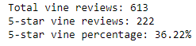
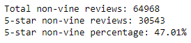

# Amazon_Vine_Analysis
## Overview
Effect of Amazon Vine program was analyzed on wireless device purchase reviews. Data was stored on an AWS RDS instance and was worked on by through the PySpark library.

## Results
When comparing Vine program reviews

and non-Vine program reviews,

we see that

- non-Vine reviews outnumber Vine reviews 64,968 to 613
- non-Vine 5-star reviews outnumber Vine reviews 30,543 to 222
- non-Vine reviews had a 47.01% 5-star rate compared to Vine reviews' 36.22% rate

## Results
Based on the percentages of 5-star reviews, the Vine program seems to result in less hyper-supportive reviews, quite contrary to the point of the program. Even considering the smaller sample of Vine reviews, there was still a higher portion of non-vine 5-star reviews. More information could be gathered on this topic if an analysis of reviews at each bracket was carried out.

A possible issue with this particular dataset would be the expensive nature of wireless products, leading to a possibly lower rate of Vine program participants.
